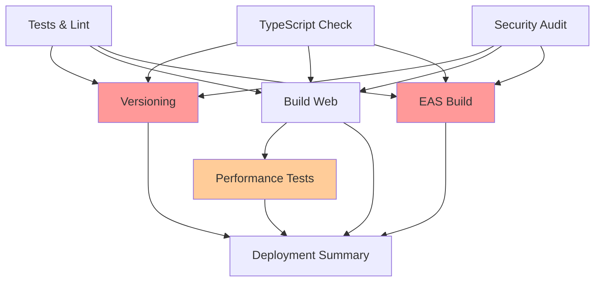
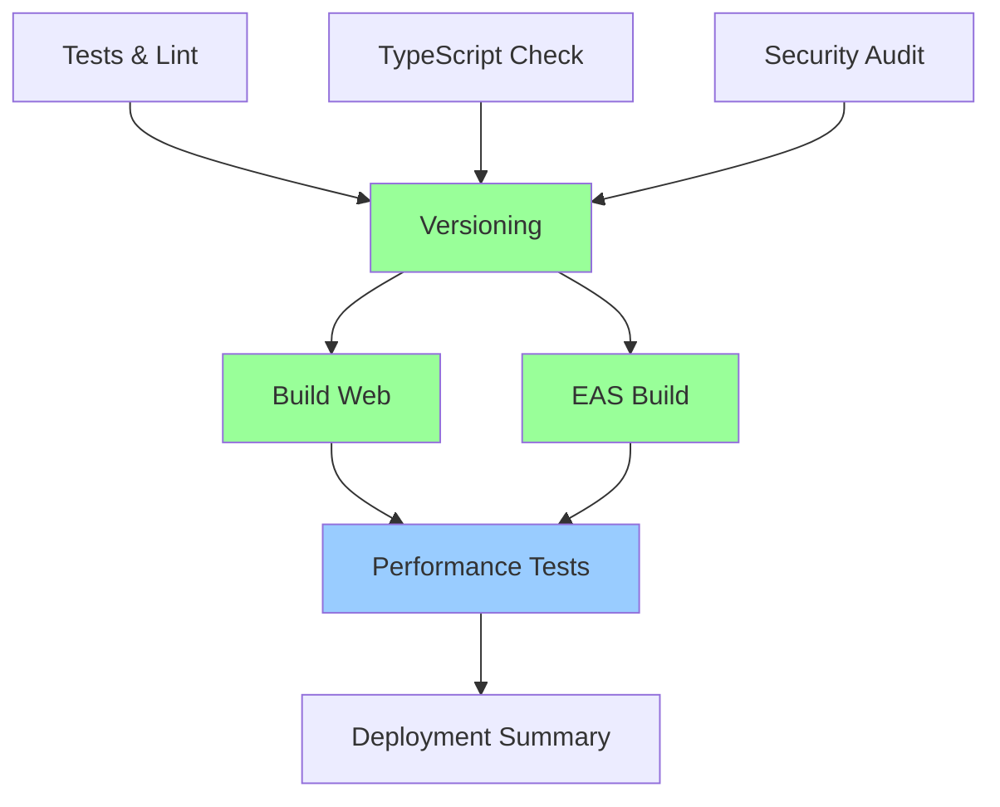

# 🔄 CI/CD Workflow Order - Before vs After

## ❌ Previous (Illogical) Order

**Problems:**
- 🚨 **EAS Build runs in parallel with Versioning** → Gets OLD version numbers
- 🚨 **Performance Tests run AFTER EAS Build** → Wrong order for quality gates
- 🚨 **Versioning doesn't affect builds** → Version inconsistency

## ✅ New (Logical) Order

**Benefits:**
- ✅ **Sequential Quality Gates**: Tests → Versioning → Builds → Performance → Deploy
- ✅ **Version Consistency**: Both builds use the NEW version from versioning step
- ✅ **Performance Validation**: Tests run AFTER builds are complete
- ✅ **Parallel Efficiency**: Web and EAS builds run in parallel (both with correct version)

## 📋 Detailed Workflow Steps

### Phase 1: Quality Gates (Parallel)
1. **Tests & Lint** - Unit tests, coverage, ESLint
2. **TypeScript Check** - Type safety validation  
3. **Security Audit** - npm audit, dependency scanning

### Phase 2: Versioning (Sequential)
4. **Simple Versioning** - Generate new version (1.0.X) using commit count

### Phase 3: Build Artifacts (Parallel)
5. **Build Web App** - Expo web export with NEW version
6. **EAS Build** - iOS/Android builds with NEW version (if enabled)

### Phase 4: Quality Validation (Sequential)
7. **Performance Tests** - Lighthouse CI on web build

### Phase 5: Summary (Final)
8. **Deployment Summary** - Status report with all results

## 🎯 Key Improvements

| Aspect | Before | After |
|--------|--------|-------|
| **Version Consistency** | ❌ Builds use old version | ✅ Builds use new version |
| **Quality Gates** | ❌ Performance tests after EAS | ✅ Performance tests before deploy |
| **Efficiency** | ❌ Unnecessary parallel jobs | ✅ Logical parallel execution |
| **Reliability** | ❌ Race conditions possible | ✅ Clear dependencies |
| **Debugging** | ❌ Hard to trace issues | ✅ Clear failure points |

## 🚀 Workflow Triggers

- **All Branches**: Tests, TypeScript, Security
- **Main Branch Only**: Versioning, EAS Build (if enabled), Performance Tests
- **Main/Develop/Feature**: Web Build
- **Always**: Deployment Summary

This ensures the right balance of thorough testing on main while allowing feature branch validation.
